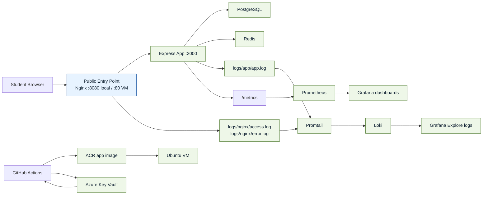

# DevOps Guided Project

## Start Here

This repository is designed as a guided journey.

Start at **Step 1** and follow the links in order.
Each document or lab should hand you to the next one.

## Overview

This repository is a 6-hour guided DevOps project for junior DevOps and cloud engineers.

The project teaches one simple story:

1. code
2. run the service
3. observe it
4. package it
5. push it
6. deploy it
7. verify it
8. recover it

The app is intentionally small.
The DevOps workflow is the main lesson.

## Architecture



### Service Exposure Model

- public locally: Nginx on `http://localhost:8080`
- public on VM: Nginx on port `80`
- private by default: app, PostgreSQL, Redis, Loki, Promtail
- localhost-only on VM: Grafana and Prometheus through SSH tunnel

### Core Runtime Files

- app service: `app/src/server.js`
- app image build: `docker/app.Dockerfile`
- local stack: `docker-compose.yml`
- VM stack: `docker-compose.vm.yml`
- reverse proxy: `docker/nginx/nginx.conf`
- metrics scrape config: `monitoring/prometheus/prometheus.yml`
- log shipping config: `monitoring/promtail/promtail-config.yml`
- log storage config: `monitoring/loki/loki-config.yml`
- Grafana provisioning: `monitoring/grafana/provisioning/`

## Learning Objectives

- run a small web service through Docker Compose
- understand how PostgreSQL and Redis support the app
- use Nginx as the public entry point
- compare metrics and logs during troubleshooting
- build and push an image to ACR
- deploy the image to an Ubuntu VM
- recover from a few common failures

## Prerequisites

- Docker and Docker Compose
- Git
- basic Linux commands
- basic understanding of containers and CI/CD

For the exact install commands and validation path, start with [Prerequisites and Validation](docs/01-prerequisites-and-validation.md).

## Preflight Check

Before you start the labs, make sure the local tooling is ready:

```bash
docker --version
docker compose version
docker ps
```

What good looks like:

- `docker --version` prints a Docker version
- `docker compose version` prints the Compose plugin version
- `docker ps` runs without a daemon error

If `docker compose` is missing, install Docker Desktop or the Docker Compose v2 plugin first.

If `docker ps` cannot reach the daemon, start Docker Desktop or the Docker service before continuing.

For the full guided setup and validation sequence, read [Prerequisites and Validation](docs/01-prerequisites-and-validation.md).

## Quick Start Local

```bash
cp .env.example .env
docker compose up --build
```

On the first run, expect the image build and service startup to take a little time.

When the stack settles, run:

```bash
docker compose ps
```

What good looks like:

- `postgres` is healthy
- `redis` is healthy
- `app` is healthy
- `nginx` is healthy
- `grafana`, `prometheus`, `loki`, and `promtail` are running

Run the local milestone validator:

```bash
bash scripts/validate-local-stack.sh
```

What this starts technically:

- `app`: Express GUI and API
- `postgres`: relational data store for `items`
- `redis`: cache demo dependency
- `nginx`: public entry point
- `prometheus`: metrics storage
- `grafana`: metrics and logs UI
- `loki`: log storage
- `promtail`: log shipping from app and Nginx files

To understand how requests, data, logs, and metrics move through the stack, read [Request And Data Flow](docs/request-and-data-flow.md).

## Local URLs

- App GUI through Nginx: [http://localhost:8080](http://localhost:8080)
- Grafana: [http://localhost:3000](http://localhost:3000)
- Prometheus: [http://localhost:9090](http://localhost:9090)

## Run Tests

```bash
cd app
npm ci
npm test
```

If `npm test` fails because `node` is missing, install Node.js 20 or later before continuing.

## Use the GUI

Open the DevOps Control Panel at `http://localhost:8080`.

Use it to:

- check health
- check readiness
- inspect version info
- read and create PostgreSQL items
- test Redis caching
- generate a slow request
- generate a 500 error
- see how each request moves through Nginx, the app, PostgreSQL or Redis, and the observability stack
- jump into Grafana and Prometheus with shortcuts that adapt to local use or VM SSH-tunnel use

## Logs

Use Grafana Explore for app and Nginx logs.

Use CLI logs for all services:

```bash
docker compose logs app --tail=50
docker compose logs nginx --tail=50
docker compose logs postgres --tail=50
docker compose logs redis --tail=50
```

Nginx file logs:

```bash
tail -f logs/nginx/access.log
tail -f logs/nginx/error.log
```

Run the observability milestone validator after LAB-04:

```bash
bash scripts/validate-observability.sh
```

## Metrics

Prometheus scrapes the app internally.

Open Grafana and use the provisioned dashboard:

- request rate
- error count
- latency
- DB readiness
- Redis readiness
- build info

## Sanity Checks

Run the lightweight project sanity checks before you demo or deploy:

```bash
bash scripts/validate-project.sh
```

## Manual Image Build

```bash
docker build -f docker/app.Dockerfile -t devops-mini-app:manual .
```

## GitHub Actions

Workflows:

- `.github/workflows/ci-build-push.yml`
- `.github/workflows/deploy-vm.yml`

`ci-build-push.yml`:

- tests on pull request
- tests, builds, and pushes on `main`
- publishes to ACR
- produces `latest` and `sha-<short-sha>` tags that students should verify in the workflow logs and the ACR repository

`deploy-vm.yml`:

- deploys a selected image tag to a VM over SSH
- reads runtime secrets from Azure Key Vault when Azure OIDC is configured
- falls back to GitHub Secrets when Azure Key Vault is not ready yet

## VM Deployment

Use:

1. `deploy/vm-setup.sh`
2. `deploy/deploy.sh`
3. `deploy/README.md`
4. `docs/vm-deployment.md`

For the GitHub Actions deploy path:

- keep VM access values in GitHub Secrets
- use Azure Key Vault as the preferred runtime secret source
- keep matching GitHub Secrets as the fallback path for classroom continuity

Recommended Azure Key Vault secret names for this project:

- `POSTGRES_PASSWORD`
- `GRAFANA_ADMIN_PASSWORD`
- `REGISTRY_LOGIN_SERVER`
- `REGISTRY_USERNAME`
- `REGISTRY_PASSWORD`

Grafana on the VM is localhost-only by default.

Use an SSH tunnel:

```bash
ssh -L 3000:localhost:3000 USER@VM_PUBLIC_IP
```

After deployment, run:

```bash
bash scripts/validate-vm-deployment.sh http://YOUR_VM_PUBLIC_IP
```

## Cleanup

```bash
docker compose down -v
```

## Guided Journey

### Step 1. Prepare your laptop

Read:

- [Prerequisites and Validation](docs/01-prerequisites-and-validation.md)

Run:

- `bash scripts/validate-prerequisites.sh`

### Step 2. Understand the project story

Read:

- [LAB-00 Course Map](labs/LAB-00-course-map.md)
- [Architecture](docs/architecture.md)
- [App GUI](docs/app-gui.md)

### Step 3. Start the stack locally

Do:

- [LAB-01 Run Locally and Use GUI](labs/LAB-01-run-locally-and-use-gui.md)
- [LAB-02 Compose Layers DB Cache](labs/LAB-02-compose-layers-db-cache.md)
- [LAB-03 Nginx Reverse Proxy](labs/LAB-03-nginx-reverse-proxy.md)

Run:

- `bash scripts/validate-local-stack.sh`

### Step 4. Learn the observability path

Do:

- [LAB-04 Logging Dashboard](labs/LAB-04-logging-dashboard.md)
- [LAB-05 Metrics and Grafana](labs/LAB-05-metrics-and-grafana.md)

Read:

- [Logging](docs/logging.md)
- [Monitoring](docs/monitoring.md)

Run:

- `bash scripts/validate-observability.sh`

### Step 5. Learn the delivery path

Do:

- [LAB-06 GitHub Actions ACR](labs/LAB-06-github-actions-acr.md)

Read:

- [Registries](docs/registries.md)
- [Azure Key Vault and Secrets Flow](docs/secrets-and-azure-key-vault.md)
- [VM Deployment](docs/vm-deployment.md)

### Step 6. Deploy and verify

Do:

- [LAB-07 Deploy to VM](labs/LAB-07-deploy-to-vm.md)

Run:

- `bash scripts/validate-vm-deployment.sh http://YOUR_VM_PUBLIC_IP`

### Step 7. Break and recover

Do:

- [LAB-08 Failure and Recovery](labs/LAB-08-failure-and-recovery.md)

Keep open:

- [Troubleshooting](docs/troubleshooting.md)

## Milestone Validators

1. Environment ready
   Validation: `bash scripts/validate-prerequisites.sh`
2. Local stack running
   Validation: `bash scripts/validate-local-stack.sh`
3. Observability working
   Validation: `bash scripts/validate-observability.sh`
4. Repo integrity checked
   Validation: `bash scripts/validate-project.sh`
5. VM deployment verified
   Validation: `bash scripts/validate-vm-deployment.sh http://YOUR_VM_PUBLIC_IP`

## Documentation Sequence

Read the project documents in this order:

1. [Documentation Guide](docs/README.md)
2. [Prerequisites and Validation](docs/01-prerequisites-and-validation.md)
3. [Architecture](docs/architecture.md)
4. [Runtime Stack](docs/runtime-stack.md)
5. [App GUI](docs/app-gui.md)
6. [Request And Data Flow](docs/request-and-data-flow.md)
7. [Logging](docs/logging.md)
8. [Monitoring](docs/monitoring.md)
9. [Registries](docs/registries.md)
10. [Azure Key Vault and Secrets Flow](docs/secrets-and-azure-key-vault.md)
11. [VM Deployment](docs/vm-deployment.md)
12. [Troubleshooting](docs/troubleshooting.md)
13. [Trainee Validation Findings](docs/trainee-validation-findings.md)

## Next Step

Begin with [Step 1: Prerequisites and Validation](docs/01-prerequisites-and-validation.md).
